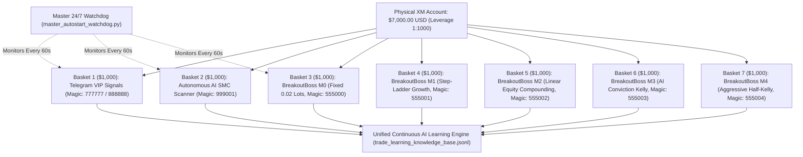

# 🚀 BREAKOUTBOSS: 7-BASKET 5-MODEL AUTONOMOUS TRADING & COMPOUNDING SUITE

**Release Tag**: `BreakoutBoss`  
**System Architecture**: 7 Autonomous Virtual Capital Baskets ($1,000 USD each, $7,000 Total Capital Pool)  
**Broker Environment**: XM Global MT5 Live Account (`#167573094`) | Leverage: **1:1000** | Balance: **$7,000.00**  
**Working Directory**: `c:\anlyzeforex\forextele`  
**Runtime**: Python 3.11 64-bit  

---

## 🏛️ 1. Capital Pool & Virtual Basket Architecture

To ensure strict risk ring-fencing with **zero cross-strategy contagion**, the $7,000 physical account balance is partitioned into **seven $1,000.00 virtual sub-portfolios**.

Each basket calculates position size, risk, and compounding strictly off its own virtual equity curve:
$$\text{Virtual Equity}_i = \$1,000.00 + \sum(\text{Closed Deals PnL for Magic}_i) + \sum(\text{Floating PnL for Magic}_i)$$



---

## ⚙️ 2. The 5 BreakoutBoss Compounding Models

All 5 models trade the **same high-expectancy Gold Breakout & Retest setups** across 6 global sessions (Asian, Frankfurt, London, NY Pre-Mkt, NY Cash, London Close) on M1, M3, M5, and M15 timeframes. They differ only in **position sizing and risk compounding philosophy**:

| Model ID | Model Name | Magic Number | MT5 Order Remark | Lot Sizing Logic | 1-Month Backtest ROI | 1-Month Max Drawdown |
| :---: | :--- | :---: | :--- | :--- | :---: | :---: |
| **M0** | **Baseline Fixed** | `555000` | `BB_M0_<SESS>_M<TF>` | Strictly **0.02 Lots** (Fixed risk, zero compounding) | **+238.4%** ($3,384) | 17.8% ($358) |
| **M1** | **Milestone Step-Ladder** | `555001` | `BB_M1_<SESS>_M<TF>` | Milestone Brackets ($1.4k➔0.03, $2k➔0.04, $2.8k➔0.06, $3.8k➔0.08, $5k➔0.10) | **+566.4%** ($6,664) | **14.7%** ($1,125) |
| **M2** | **Linear Equity** | `555002` | `BB_M2_<SESS>_M<TF>` | `round((Virtual_Equity / 1000) * 0.02, 2)` (min 0.01, max 0.40) | **+661.9%** ($7,619) | 20.8% ($1,976) |
| **M3** | **AI Conviction Kelly** | `555003` | `BB_M3_<SESS>_M<TF>` | Linear Equity scaled by Session Win-Rate (Frankfurt/LNC 1.35x, NY 1.15x, LON 1.0x, Asia 0.70x) | **+1,070.5%** ($11,705) | 26.2% ($4,149) |
| **M4** | **Aggressive Half-Kelly** | `555004` | `BB_M4_<SESS>_M<TF>` | `round((Virtual_Equity / 1000) * 0.03, 2)` (min 0.01, max 0.50) | **+1,705.6%** ($18,056) | 24.4% ($5,628) |

---

## 🛡️ 3. Execution & Risk Management Rules

1. **Volatility Contraction Filter**: Skips first-candle ranges exceeding timeframe caps (M1 > $3.50, M3 > $5.00, M5 > $6.50, M15 > $9.00) to avoid entering on exhaustion wicks.
2. **Breakout & Retest Confirmation**: Requires price penetration beyond the level followed by a pullback retesting the level with buyer/seller rejection confirmation.
3. **Adaptive Structural Stop Loss**: Halves risk distance to $2.20–$2.50 or midpoint of reference bar.
4. **+1R Dynamic Break-Even Trailing**: Once price reaches +1.0R in profit ($risk distance), the SL is automatically modified to **Entry + $0.10**, guaranteeing a risk-free trade.
5. **Mandatory EOD Hard Close**: All open trades are forcibly closed before **20:50 UTC (03:20 AM IST)** prior to daily rollover market pause.
6. **MT5 31-Character Comment Limit**: All order remarks are formatted as `BB_<MID>_<SESS>_M<TF>` (e.g. `BB_M0_FRA_M1`, `BB_M3_NYC_M5`), staying strictly under 25 characters.

---

## 🧠 4. Unified Continuous AI Learning Integration

Every order placed by all 7 systems is reverse-engineered and recorded by [`AITradeLearningEngine`](file:///c:/anlyzeforex/forextele/ai_trade_learning_engine.py):
- **On Entry**: Ingests real-time MT5 market context (M5/M15 swing structure, H1 EMA 50/200 trend, Fair Value Gaps, RSI-14, institutional round numbers) into [`data/trade_learning_knowledge_base.jsonl`](file:///c:/anlyzeforex/forextele/data/trade_learning_knowledge_base.jsonl).
- **On Exit**: Intercepts closed deals from MT5 history, computes exact PnL and outcome (`WIN`, `LOSS`, `BE`), and recalibrates model conviction profiles in [`data/channel_archetypes_and_rules.json`](file:///c:/anlyzeforex/forextele/data/channel_archetypes_and_rules.json).

---

## 🧪 5. Automated QA Test Suite Results

10 automated QA tests were executed in [`scratch/qa_breakoutboss_5models_test.py`](file:///c:/anlyzeforex/forextele/scratch/qa_breakoutboss_5models_test.py):

| Test # | Test Description | Result |
| :---: | :--- | :---: |
| 1 | Core Scripts Syntax & Bytecode Compilation | ✅ **PASSED** |
| 2 | Model 0 (Fixed) 0.02 Lots Verification | ✅ **PASSED** |
| 3 | Model 1 (Step-Ladder) Milestone Scaling Boundaries | ✅ **PASSED** |
| 4 | Model 2 (Linear Equity) Continuous Proportionality | ✅ **PASSED** |
| 5 | Model 3 (AI Conviction) Session Kelly Weighting | ✅ **PASSED** |
| 6 | Model 4 (Half-Kelly) 0.03 Lots / $1k Scaling | ✅ **PASSED** |
| 7 | MT5 31-Character Order Comment Enforcement | ✅ **PASSED** |
| 8 | 8 Globally Unique Magic Numbers (Zero Collision) | ✅ **PASSED** |
| 9 | AI Learning Engine Record/Update Interface | ✅ **PASSED** |
| 10 | Flask Dashboard Web Application Health (`/` 200 OK) | ✅ **PASSED** |

---

## 🚀 6. Operational Commands

- **Check 7-Basket Live Performance**:
  ```cmd
  CHECK_3DAY_PERFORMANCE.bat
  ```
  *(or `py -3.11 check_3day_performance.py`)*

- **Restart All 7 Engines**:
  ```cmd
  RESTART_ALL_ENGINES.bat
  ```

- **Master 24/7 Watchdog Supervisor**:
  Runs continuously in the background, verifying terminal, Telegram, SMC scanner, and BreakoutBoss every 60 seconds.
